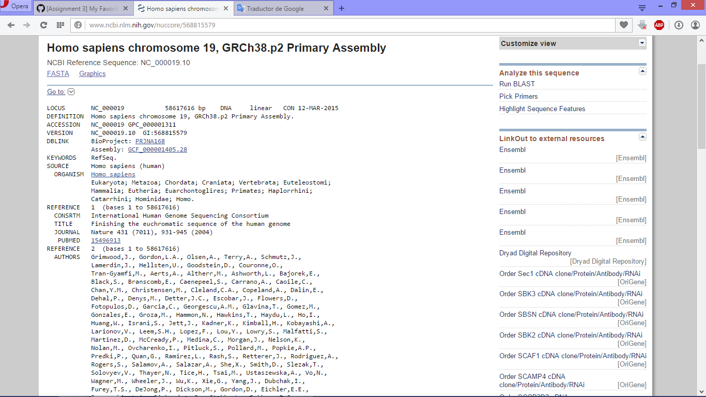
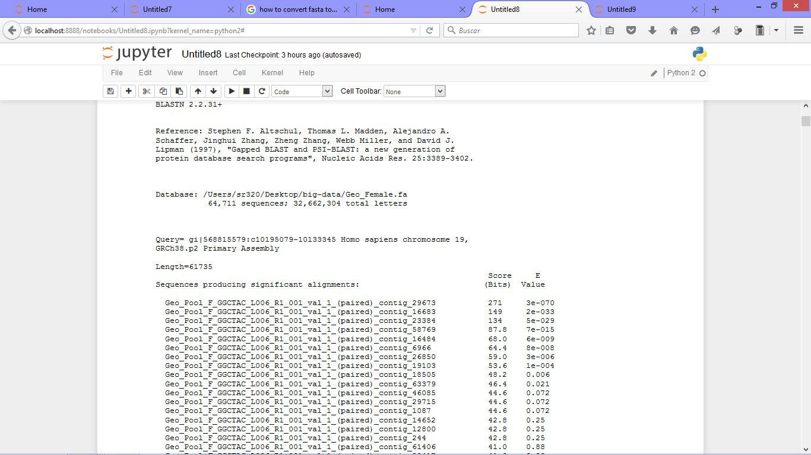

My favorite gene web page
-
GEN BANK GENE SEARCH AND BLAST

In the database of GENE in the NCBI i made a search of the genes for this excersise, i chose **homo sapiens chromosome 19, grch38.p2 primary assembly** (accession 568815579) 

and downloaded the fasta file and keep in the folder "query" in this location "\Users\534\Desktop\big-data\blast\query\Homo-sapiens-chromosome19.fasta \" 
Next of this made a data base whit these files:

1: Geo_Female.nhr
2: Geo_Female.nin
3: Geo_Female.nsq
4: Geo_Male.nhr
5: Geo_Male.nin
6: Geo_Male.nsq
7: Oly_Female.nhr
8: Oly_Female.nin
9: Oly_Female.nsq
10: Oly_Male.nhr
11: Oly_Male.nin
12: Oly_Male.nsq

With the data base Geo_Female was compared the fasta file secuence by a BlsatN:

!blastn \

-task blastn \
-query /Users/534/Desktop/big-data/blast/query/Homo-sapiens-chromosome19.fasta \

-db /Users/534/Desktop/big-data/blast/db1/Geo_Female \

-out /Users/534/Desktop/big-data/blast/out/blastn_H_sapiens_Female.out

In my first attempt of blast, a E value of 1E-20 was very resctrictive to compare a Hunan secuece versus a Geoduck sencuences, and i not have results for this blast:

!blastn \

outfmt 6 \

-max_target_seqs 1 \

-evalue 1E-20 \

-query \Users\534\Desktop\big-data\blast\query\Homo-sapiens-chromosome19.fasta \

-db \Users\534\Desktop\big-data\blast\db1\Geo_Female \

-out \Users\534\Desktop\big-data\out\blastn_H_sapiens_Female.out